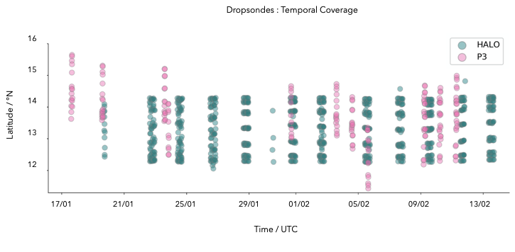
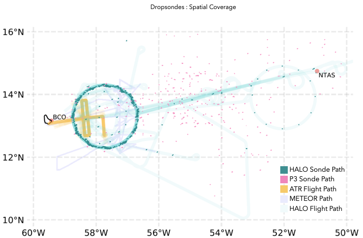

# JOANNE - The EUREC4A Dropsonde Dataset

 

  

JOANNE is the dataset for all dropsondes launched as part of the EUREC4A-ATOMIC campaign held in January-February, 2020. These include the dropsondes from DLR's [HALO](https://www.halo.dlr.de/) aircraft and NOAA's [WP-3D (N43-RF)](https://www.omao.noaa.gov/learn/aircraft-operations/aircraft/lockheed-wp-3d-orion) aircraft.

The acronym JOANNE stands for **J**oint dropsonde-**O**bservations of the **A**tmosphere in tropical **N**orth atla**N**tic large-scale **E**nvironments. The name is an ode to Joanne Malkus Simpson, whose contributions to tropical meteorology are fundamental to the field.

## Products 

The different products of JOANNE are listed in the table below. Click on a product to go to its directory, which contains sample data files, along with more information about the product.

| Level                        | Description                                                                                    |
| ---------------------------- | ---------------------------------------------------------------------------------------------- |
| [Level - 0](joanne/Level_0/) | The raw files of all dropsonde launches from EUREC4A                                |
| [Level - 1](joanne/Level_1/) | Files generated from the ASPEN-processing of all the raw files in Level-0                      |
| [Level - 2](joanne/Level_2/) | Sounding files that passed additional QC tests, and exclude all soundings with no usable data  |
| [Level - 3](joanne/Level_3/) | All sounding files in Level-2 gridded on a uniform, vertical grid, with some derived variables |
| [Level - 4](joanne/Level_4)  | Circle products from all circles flown during EUREC4A                               |

## Sampling Coverage

| Platform  | Sondes   | Circles        |
| --------- | -------- | -------------- |
| HALO      | 896      | 71 (+1 clover) |
| P3        | 322      | 14             |
| **Total** | **1218** | **85**         |

 

 

